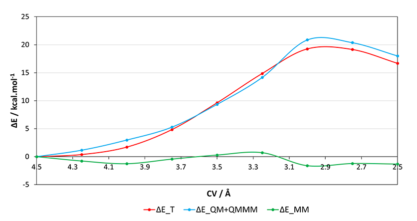
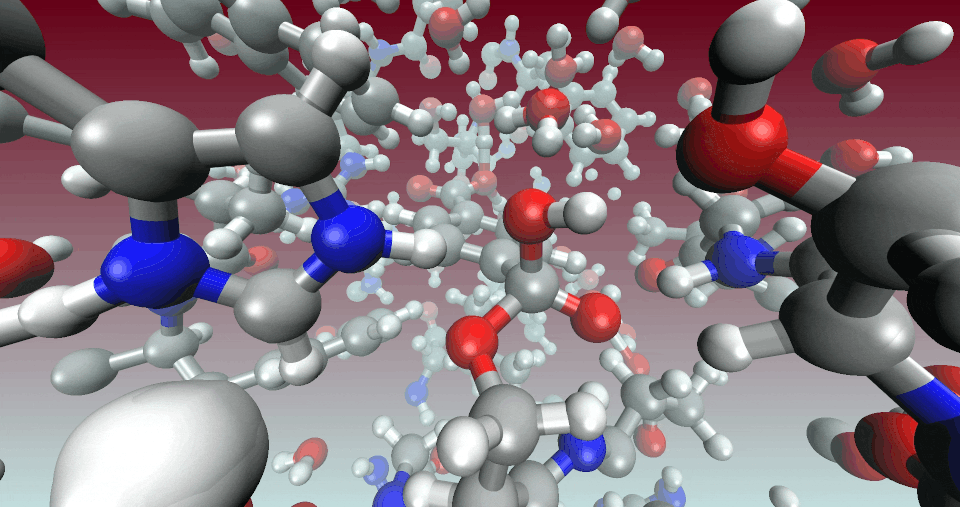

 <h3><p align="center"> </b> II - Potential energy surface scan to explore a trial reaction coordinate</b> </p> </h3>

<br/>

```js
&GLOBAL
    RUN_TYPE GEO_OPT
...
```

---

<br/>
 
In this section, we obtain both a TS guess and initial coordinates for the CI-NEB method:

- <p align="justify">To alleviate the load of the optimization algorithms and ensure that the MM portion of the hamiltonian remains somewhat constant (i.e. the total energy is dominated by the energy change in the QM region) along the reaction path, we can fix a part of the system. To do so, we can start by chosing a VMD selection similar to the following:</p>

```js
same residue as all not within 15 of resname LIG
same residue as all not within 15 of (resname LIG or protein)
```

<br/>
 
- <p align="justify">Then we print the atom serial numbers of the selection to a file using the VMD command line.</p>

```js
set sel [atomselect top "same residue as all not within 15 of (resname LIG or protein)"]
set outfile [open freeze.dat w]
puts $outfile [$sel get serial]
close $outfile
```

<br/>
 
- <p align="justify">We can't use the freeze.dat file directly to specify the LIST of atoms to fix because CP2K cannot parse so many atoms per line, therefore you have to modify this file. A workaround can be done with a bash script, printing 100 atoms per LIST line to the fixed_atoms.inc file, which is then specified in the CP2K input.</p>

```js 
FIXED_ATOMS=(`cat freeze.dat`)
LIST_NUMBER=$(("${#FIXED_ATOMS[@]}"/100))
for i in `seq 0 1 "$LIST_NUMBER"`; do 
    echo -n "LIST "
    echo "${FIXED_ATOMS[@]:$(("$i"*100)):100}"
done > fixed_atoms.inc
```
```js
&MOTION
    ...
    &CONSTRAINT
        &FIXED_ATOMS
            @INCLUDE fixed_atoms.inc
        &END FIXED_ATOMS
    ...
```

<br/>
 
- <p align="justify">Then we have to set the collective variable (CV) that we want to use as a trial reaction coordinate in the &FORCE_EVAL/&SUBSYS section of the input. CP2K offers many functions to define CVs, here we are using a &DISTANCE_FUNCTION CV which is a distance addition (i.e. COEFFICIENT +1.0) function that assumes the form CV=d1+d2.</p>

```js
&FORCE_EVAL
    ...
    &SUBSYS
        ...
        &COLVAR
            &DISTANCE_FUNCTION
                ATOMS 2590 28386 7003 28388
                COEFFICIENT +1.0
            &END DISTANCE_FUNCTION
        &END COLVAR
        ...
```

<br/>
 
- <p align="justify">And we decide what happens to the CV in the &MOTION/&CONSTRAINT/&COLLECTIVE section, where the TARGET keyword is the value of the constrained CV and the &RESTRAINT section specifies a force constant of 50.0 angstrom^-2*kcalmol for the harmonic restraint.</p>

```js
&MOTION
    ...
    &CONSTRAINT
        &COLLECTIVE
            COLVAR 1
            INTERMOLECULAR TRUE
            TARGET [angstrom] TARGET_TAG
                &RESTRAINT
                    K [angstrom^-2*kcalmol] 50.0
                &END RESTRAINT
        &END COLLECTIVE
        ...
```

<br/>
 
- <p align="justify">CP2K doesn't offer a functionality to calculate a PES scan automatically, but we can do it on your own with a bit of bash scripting. The script bellow can be used to emulate a PES scan, by using a scan.inp template to produce a GEO_OPT input that loads the structure from the last step*, for each CV value. Here, the CV will be constrained from 4.50 to 2.50 in intervals of 0.25 (use a small interval, otherwise CP2K might abort), and the input file will be modified by replacing the SCAN_TAG RESTART_TAG and TARGET_TAG strings with their respective value.</p>

<p align="justify">*Note that the restart file name from the last geometry optimization of the previous tutorial section has to be changed to SCAN_4.75-1.restart to be read as the first structure.</p>

```js
for i in `seq 4.50 -0.25 2.50`; do
        LAST_GEO=`echo "$i" + 0.25 | bc -l`
        cp scan.inp scan_"$i".inp
        sed -i 's/SCAN_TAG/SCAN_'"$i"'/g' scan_"$i".inp
        sed -i 's/RESTART_TAG/SCAN_'"$LAST_GEO"'-1.restart/g' scan_"$i".inp
        sed -i 's/TARGET_TAG/'"$i"'/g' scan_"$i".inp

        cp2k.popt -i scan_"$i".inp -o scan_"$i".out

        wait
done
```

<br/>
 
- <p align="justify">The &EXT_RESTART section should specify to load everything but the constraints and counters from the restart file.</p>

```js
&EXT_RESTART
    RESTART_FILE_NAME RESTART_TAG
    RESTART_DEFAULT .TRUE.
    RESTART_CONSTRAINT .FALSE.
    RESTART_COUNTERS .FALSE.
&END EXT_RESTART
```

<br/>
 
- <p align="justify">After running all the PES scan points, we can use the cp2k_energy_analysis.sh script to print the decomposition of the energy for each output.</p>

```js
./cp2k_energy_analysis.sh scan_*.out
Reverse order? (y/n)
y
| OUTPUT 	| GEOPT CYCLES 	| E_T/Hartree 		| E_QM+QMMM/Hartree 	| E_MM/Hartree 		| ΔE_T/kcal.mol-1 	| ΔE_QM+QMMM/kcal.mol-1 | ΔE_MM/kcal.mol-1 	|
scan_4.50.out 	 26 	-1101.562301145778292 	-269.45241047339886 	-832.109890672379432	0.000000000000000	0.000000000000000	0.000000000000000
scan_4.25.out 	 57 	-1101.561702718561946 	-269.45057143793144 	-832.111131280630506	0.375513078257115	1.153994755806050	-0.778481677548935
scan_4.00.out 	 68 	-1101.559579686170991 	-269.44767950284739 	-832.111900183323601	1.707715903581377	2.968684021047425	-1.260968117466047
scan_3.75.out 	 35 	-1101.554593173562125 	-269.44400306700533 	-832.110590106556795	4.836752565644793	5.275647511940075	-0.438894946295282
scan_3.50.out 	 74 	-1101.546967511229923 	-269.43752310212847 	-832.109444409101453	9.621855679101548	9.341825472169725	0.280030206931823
scan_3.25.out 	 48 	-1101.538629686861213 	-269.42986051759254 	-832.108769169268673	14.853840470467073	14.150097268465800	0.703743202001272
scan_3.00.out 	 68 	-1101.531628450303515 	-269.41916696488789 	-832.112461485415625	19.247116410422567	20.860301590633675	-1.613185180211108
scan_2.75.out 	 67 	-1101.531794161027847 	-269.41994863747573 	-832.111845523552117	19.143132930904237	20.369802041764075	-1.226669110859837
scan_2.50.out 	 158 	-1101.535725675905041 	-269.42372519260118 	-832.112000483303861	16.676107345465003	18.000013700544200	-1.323906355079197
```

<br/>
 
 <div align="center">
    
</div>
 
 <br/>
 
<div align="center">
    
</div>

