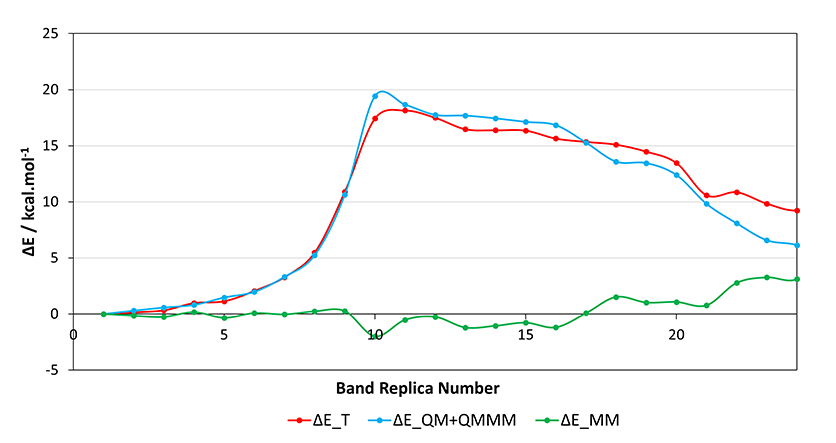

<br>
<h2><p align="center"> III - Minimum energy path using the NEB method </p></h2>

<br/>
 
```js
&GLOBAL
    RUN_TYPE BAND
...
```

---

<br/>
 
In this section of the tutorial, we use the optimized strutures of the PES scan to obtain a minimum energy path connecting the reactant and product:

- <p align="justify">We need to specify a new &MOTION/&BAND section, with the BAND_TYPE CI_NEB keyword to activate the climbing image nudged elastic band method. The number of available processors will limit the number of replicas to be run, according to the relation N MPI tasks = NPROC_REP x NUMBER_OF_REPLICA. Note, it is very important to use enough replicas to guarantee the quality of your MEP results, otherwise the distance between replicas might be too large (check the main ouput for the RMSD distance between adjacent replicas, the DISTANCES REP values must be at least 1-2 Å). The value of the spring constant used in the band K_SPRING is the default and we turn off the ROTATE_FRAMES and ALIGN_FRAMES keywords. The USE_COLVARS keyword is turned on to project the band in a subspace of CVs in order to help achieve convergence, and the POT_TYPE ME keyword is set to calculate the minimum energy path.</p>

```js
&MOTION
    &BAND
        BAND_TYPE CI-NEB
        NPROC_REP 1
        NUMBER_OF_REPLICA 32
        K_SPRING 0.08
        ROTATE_FRAMES F
        ALIGN_FRAMES F
        USE_COLVARS .TRUE.
        POT_TYPE ME
        ...
...
```
```js

 BAND TYPE                     =                                          CI-NEB
 BAND TYPE OPTIMIZATION        =                                            DIIS
 STEP NUMBER                   =                                              41
 NUMBER OF NEB REPLICA         =                                              32
 DISTANCES REP =        0.144996        0.146965        0.154644        0.174849
                        0.226232        0.256066        0.405007        0.533637
                        0.792803        0.894967        0.119205        0.135772
                        0.149995        0.191537        0.225544        0.277525
                        0.302038        0.359086        0.397839        0.395196
                        0.325360        0.261616        0.193717        0.132262
                        0.274894        0.411159        0.358893        0.378561
                        0.279888        0.247479        0.236883
 ENERGIES [au] =    -1101.562341    -1101.562085    -1101.561804    -1101.560772
                    -1101.560673    -1101.559140    -1101.558322    -1101.555122
                    -1101.549315    -1101.535437    -1101.533395    -1101.534400
                    -1101.536058    -1101.536202    -1101.536389    -1101.537449
                    -1101.537862    -1101.538311    -1101.539228    -1101.540785
                    -1101.545746    -1101.545264    -1101.546910    -1101.547796
                    -1101.546798    -1101.547221    -1101.547372    -1101.546369
                    -1101.543620    -1101.544619    -1101.544214    -1101.545160
 BAND TOTAL ENERGY [au]        =                           -35249.41787031546846
```

<br/>
 
- <p align="justify">By turning USE_COLVARS on, we have to specify the CVs that we are using in the &FORCE_EVAL/&SUBSYS and &MOTION/&CONSTRAINT section, as well as a &MOTION/&CONSTRAINT/&COLLECTIVE/&RESTRAINT section with a force constant of our choosing.</p>

```js
&FORCE_EVAL
    ...
    &SUBSYS
        &COLVAR
            &DISTANCE_FUNCTION
                ATOMS 2590 28386 7003 28388
                COEFFICIENT +1.0
        	...
```
```js
&MOTION
    ...
    &CONSTRAINT
        &COLLECTIVE
            COLVAR 1
            INTERMOLECULAR TRUE
                &RESTRAINT
                    K [angstrom^-2*kcalmol] 50.0
                ...
```

<br/>
 
- <p align="justify">The &MOTION/&BAND/&CONVERGENCE_CONTROL section sets the convergence criteria for the band.</p>

```js
&MOTION
    &BAND
    ...
        &CONVERGENCE_CONTROL
            MAX_FORCE 0.0030
            RMS_FORCE 0.0050
            MAX_DR 0.002
            RMS_DR 0.005
        ...
```

<br/>
 
- <p align="justify">The NSTEPS_IT keyword in the &MOTION/&BAND/&CI-NEB section specifies the number of improved tangengent nudged elastic band (IT-NEB) steps to be employed before switching to CI-NEB.</p>

```js
&MOTION
    &BAND
    ...
        &CI_NEB
            NSTEPS_IT  5
        ...
```

<br/>
 
- <p align="justify">The &MOTION/&BAND/&OPTIMIZE_BAND section defines the optimization method used for the band, and the OPTIMIZE_END_POINTS optimizes the end points of the band when turned on.</p>

```js
&MOTION
    &BAND
    ...
        &OPTIMIZE_BAND
            OPT_TYPE DIIS
            OPTIMIZE_END_POINTS T
                &DIIS
                    MAX_STEPS 500
                ...
```

<br/>
 
- <p align="justify">And we use the optimized structures of the PES scan in XYZ format to specify the initial coordinates for each replica.</p>

```js
&MOTION
    &BAND
    ...
        &REPLICA
            COORD_FILE_NAME SCAN_4.50_DFTB-pos-1.xyz
        &END
        ...
```

<br/>
 
- <p align="justify">After the NEB calculation reaches convergence, we can use the cp2k_energy_analysis.sh script to print the decomposition of the energy for each output.</p>

```js
./cp2k_energy_analysis.sh CI_NEB-BAND*.out
Reverse order? (y/n)
n
| OUTPUT 	| GEOPT CYCLES 	| E_T/Hartree 		| E_QM+QMMM/Hartree 	| E_MM/Hartree 		| ΔE_T/kcal.mol-1 	| ΔE_QM+QMMM/kcal.mol-1 | ΔE_MM/kcal.mol-1 	|
CI_NEB-BAND01.out 	 3401 	-1101.562313398886090 	-269.45241049198228 	-832.109902906903810	0.000000000000000	0.000000000000000	0.000000000000000
CI_NEB-BAND02.out 	 2622 	-1101.562084527600746 	-269.45193957460833 	-832.110144952992416	0.143616731553360	0.295500652153625	-0.151883920600265
CI_NEB-BAND03.out 	 2745 	-1101.561794520552439 	-269.45149140708583 	-832.110303113466609	0.325596154366002	0.576725772522375	-0.251129618156373
CI_NEB-BAND04.out 	 2754 	-1101.560767662482704 	-269.45112164614790 	-832.109646016334804	0.969949593124715	0.808750761073450	0.161198832051265
CI_NEB-BAND05.out 	 3353 	-1101.560503631674464 	-269.45006913144459 	-832.110434500229874	1.135628925295315	1.469203737400475	-0.333574812105160
CI_NEB-BAND06.out 	 3293 	-1101.559040241454568 	-269.44925851085196 	-832.109781730602608	2.053906288280055	1.977868159275800	0.076038129004255
CI_NEB-BAND07.out 	 2169 	-1101.557083527751502 	-269.44712872042680 	-832.109954807324702	3.281744136953970	3.314311651063700	-0.032567514109730
CI_NEB-BAND08.out 	 2645 	-1101.553597189647689 	-269.44406816509201 	-832.109529024555679	5.469421297096627	5.234810123644425	0.234611173452203
CI_NEB-BAND09.out 	 3051 	-1101.544957311443341 	-269.43547175101878 	-832.109485560424561	10.890944870324998	10.629059954596250	0.261884915728748
CI_NEB-BAND10.out 	 2950 	-1101.534530452987156 	-269.42145364276001 	-832.113076810227146	17.433798551581085	19.425422886974425	-1.991624335393340
CI_NEB-BAND11.out 	 3642 	-1101.533398954464019 	-269.42267313154929 	-832.110725822914729	18.143813874849553	18.660193671701225	-0.516379796851673
CI_NEB-BAND12.out 	 2564 	-1101.534428883336886 	-269.42412543755586 	-832.110303445781026	17.497533507125510	17.748871652578550	-0.251338145453040
CI_NEB-BAND13.out 	 3444 	-1101.536052870358844 	-269.42423040835143 	-832.111822462007414	16.478481650846865	17.683002478358375	-1.204520827511510
CI_NEB-BAND14.out 	 2087 	-1101.536200887782570 	-269.42462423291255 	-832.111576654870020	16.385600717458800	17.435877566255575	-1.050276848796775
CI_NEB-BAND15.out 	 3031 	-1101.536255441919366 	-269.42512051039512 	-832.111134931524246	16.351367996619310	17.124463445942900	-0.773095449323590
CI_NEB-BAND16.out 	 2865 	-1101.537384192739182 	-269.42558859810725 	-832.111795594631932	15.643076857184770	16.830738406581325	-1.187661549396555
CI_NEB-BAND17.out 	 2345 	-1101.537851446305240 	-269.42806233497402 	-832.109789111331220	15.349875244483375	15.278468522683150	0.071406721800225
CI_NEB-BAND18.out 	 2323 	-1101.538249884558581 	-269.43076930417959 	-832.107480580378991	15.099855240511897	13.579845346187975	1.520009894323923
CI_NEB-BAND19.out 	 2546 	-1101.539240190217924 	-269.43097316327487 	-832.108267026943054	14.478438439274165	13.451923763899775	1.026514675374390
CI_NEB-BAND20.out 	 2761 	-1101.540851019473621 	-269.43265759328852 	-832.108193426185101	13.467643081324297	12.394943930334400	1.072699150989898
CI_NEB-BAND21.out 	 3048 	-1101.545435471753763 	-269.43676303371279 	-832.108672438040973	10.590899275535193	9.818780064104975	0.772119211430217
CI_NEB-BAND22.out 	 2738 	-1101.545006969613723 	-269.43952820107563 	-832.105478768538093	10.859784368410292	8.083637543922875	2.776146824487417
CI_NEB-BAND23.out 	 2828 	-1101.546631413628802 	-269.44193531512519 	-832.104696098503612	9.840445748948220	6.573173477823975	3.267272271124245
CI_NEB-BAND24.out 	 3388 	-1101.547593537672356 	-269.44264242123700 	-832.104951116435356	9.236712911618085	6.129464392663200	3.107248518954885
CI_NEB-BAND25.out 	 3409 	-1101.546014601105526 	-269.44475911554349 	-832.101255485562036	10.227495607303910	4.801238715340725	5.426256891963185
CI_NEB-BAND26.out 	 4022 	-1101.546248060436938 	-269.44248462266796 	-832.103763437768978	10.080999876842880	6.228482994735800	3.852516882107080
CI_NEB-BAND27.out 	 3388 	-1101.547214249618264 	-269.44530705864781 	-832.101907190970454	9.474716165560815	4.457404417379925	5.017311748180890
CI_NEB-BAND28.out 	 4062 	-1101.546334128764329 	-269.44681362272939 	-832.099520506034939	10.026992001405028	3.512035456188475	6.514956545216552
CI_NEB-BAND29.out 	 4983 	-1101.542928410642617 	-269.44654707857416 	-832.096381332068457	12.164080122779307	3.679291913595300	8.484788209184007
CI_NEB-BAND30.out 	 3751 	-1101.544558566488149 	-269.44734839812293 	-832.097210168365219	11.141157329707978	3.176463896742125	7.964693432965852
CI_NEB-BAND31.out 	 3552 	-1101.544216432580697 	-269.44370433000546 	-832.100512102575237	11.355846356634107	5.463116640454550	5.892729716179557
CI_NEB-BAND32.out 	 3215 	-1101.545169619122589 	-269.44218411988498 	-832.102985499237609	10.757721801596878	6.417048491055750	4.340673310541128
```

<br/>

 <div align="center">
    
</div>
 
 <br/>
