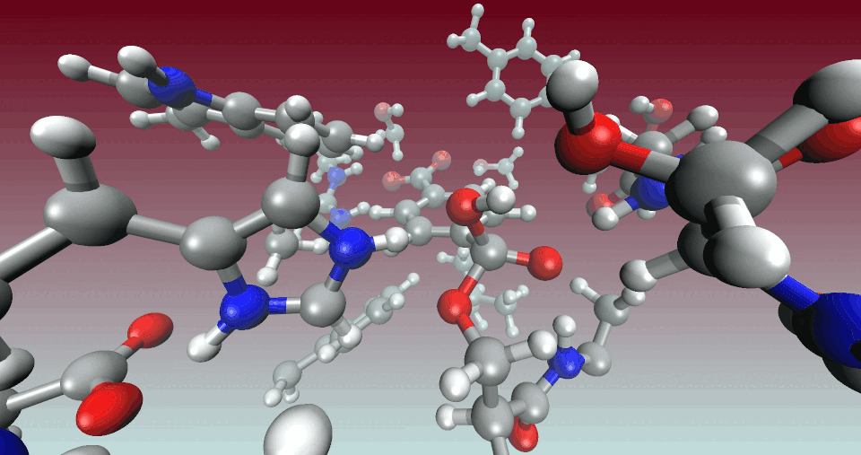

<br>
<h2><p align="center"> IV - Vibrational analysis of a TS guess </p></h2>

<br/>

```js
&GLOBAL
    RUN_TYPE VIBRATIONAL_ANALYSIS
...
```
---

<br/>
 
In this section, a vibrational analysis is performed for the TS guess obtained in the previous section to see if an imaginary frequency is found:

- <p align="justify">We extract the optimized geometry of the highest point in the MEP and run a vibrational analysis as shown below. The NPROC_REP keyword specifies the number of processors to use per replica environment (the number of available processors will limit the number of replicas, choose this parameter wisely for efficient calculations), while the &MODE_SELECTIVE and &INVOLVED_ATOMS sections allow to track modes dominated by the motion of selected atoms. The ATOM keyword of the &MODE_SELECTIVE section specifies a list of atoms to be displaced in the inital guess and the LOWEST_FREQUENCY keyword specifies the lowest frequency mode written in the output. The RANGE keyword in the &INVOLVED_ATOMS section specifies a range of frequencies to track the modes related to the chosen atoms.</p>

```js
&VIBRATIONAL_ANALYSIS
    NPROC_REP  2
    &MODE_SELECTIVE
        ATOMS 2590 28386 7003 28388
        LOWEST_FREQUENCY -5000
        &INVOLVED_ATOMS
            INVOLVED_ATOMS 2590 28386 7003 28388
            RANGE -5000 0
        &END INVOLVED_ATOMS
    &END MODE_SELECTIVE
    &PRINT
        &PROGRAM_RUN_INFO  ON
        &END PROGRAM_RUN_INFO
    &END PRINT
&END VIBRATIONAL_ANALYSIS
```

<br/>
 
- <p align="justify">If the TS guess is good, we should be able to obtain a negative frequency in the ouput. Then, we can run the cp2k_freq_analysis.sh script, choose the mode that we want to analyze and then visualize it in VMD to see if it is associated with the atoms that we have specified.</p>

```js
-------------------------------------------------------------------------------
                        FREQUENCY AND CONVERGENCE LIST
      FREQUENCY    MAXVAL CRITERIA    NORM CRITERIA    CONVERGENCE
 VIB|   -463.808     0.328500E-07        0.217E-06           YES
 VIB|     91.968     0.118932E-06        0.791E-06           YES
 VIB|     99.139     0.162794E-06        0.960E-06           YES
 VIB|    101.290     0.154508E-06        0.985E-06           YES
 VIB|    134.537     0.150224E-06        0.110E-05           YES
 VIB|    146.054     0.182583E-06        0.142E-05           YES
 VIB|    161.999     0.154916E-06        0.130E-05           YES
 VIB|    187.022     0.264591E-06        0.183E-05           YES
```

```js
./cp2k_freq_analysis.sh VIB-VIBRATIONS-1.mol forceeval_qmmm.cp2k.inc
Vibrations to analyze? (ex. : 1 2 3)
1
vmd VIB_N_1_COORD.xyz 
```

<br/>
 
<div align="center">
    
Representation: Dynamicbonds with a cutoff of 3.0 for bonds and VDW for atoms.
</div>

<br/>

- <p align="justify">We extract from the *mol file the vector associated with the displacement of coordinates of the imaginary frequency and save it to a dimer_vector.inc file that will be included in the next section of the tutorial.</p>


