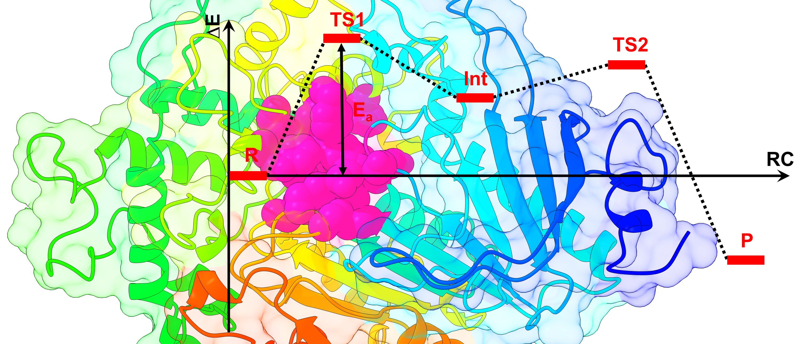

# 
 Tutorial for Transition State (TS) searches of Enzymatic Reaction Mechanisms using QM/MM methods in CP2K 

#### Author: Alexandre V. Pinto, PhD Student

**E-mail: up201402847@fc.up.pt**

<a href="https://laqv.requimte.pt/research/research-groups/407-high_performance_computing_in_molecular_modelling" target="_blank">High Performance Computing in Molecular Modelling Research Group</a> - LAQV@REQUIMTE

Department of Chemistry and Biochemistry, Faculty of Sciences, University of Porto

    

---

**
This tutorial aims to characterize, using a QM/MM methodology, the reactant, transition state and product geometries found with the climbing image nudged elastic band (CI-NEB) and the dimer methods along a given reaction path.
**

 It requires the *prmtop and *rst7 files of a solvated protein-ligand complex parameterized with an Amber force field, previously equilibrated with MD simulations in the intended ensemble, and PBC corrected. The *prmtop file and the &QMMM section of the CP2K input should be prepared according to the tutorial <a href="https://www.cp2k.org/howto:biochem_qmmm" target="_blank">QMMM for biochemical systems</a>. You need to use parmed to produce an additional *prmtop file where the charges of the QM/MM link have been corrected, considering that the MM charges of the QM region will be removed in the electrostatic embedding scheme. The QM selection should be prepared carefully, considering the demands in terms of accuracy* brought forward by the reaction in question, and in terms of calculation speed brought foward by the available computational resources. You should also follow the good practices found in the literature, other tutorials, discussion groups,... in fact most of the information present in this tutorial came from the <a href="https://www.cp2k.org/" target="_blank">CP2K site</a>, the <a href="https://manual.cp2k.org/" target="_blank">CP2K manual</a> and the <a href="https://groups.google.com/g/cp2k" target="_blank">CP2K discussion group</a>. See the bottom of this page for other useful resources. 

**
 Once these requirements are fullfiled, you are ready to start this tutorial. 
**

---

There are 5 sections:

[**I - Geometry optimization of the reactant**](enzyme_TS_cp2k_I.md)

[**II - Potential energy surface scan to explore a trial reaction coordinate**](enzyme_TS_cp2k_II.md)

[**III - Minimum energy path using the NEB method**](enzyme_TS_cp2k_III.md)

[**IV - Vibrational analysis of a TS guess**](enzyme_TS_cp2k_IV.md)

[**V - TS optimization with the Dimer method**](enzyme_TS_cp2k_V.md)

 

*Note that the QM method in the provided inputs is the semmiempirical SCC-DFTB with D3(0) dispersion correction, which allows for considerably fast calculations but has several limitations. The strategy suggested here is to get a good TS guess with SCC-DFTB-D3(0) and then refine the results with a more accurate level of theory.

---

### Useful Links:

- <a href="https://github.com/bioexcel/cp2K_qmmm_tutorials_for_biological_simulations" target="_blank">QM/MM tutorials adapted to CP2K</a>
- <a href="https://docs.bioexcel.eu/qmmm_simulation_bpg/en/main/index.html" target="_blank">Best Practices in QM/MM Simulation of Biomolecular Systems</a>

